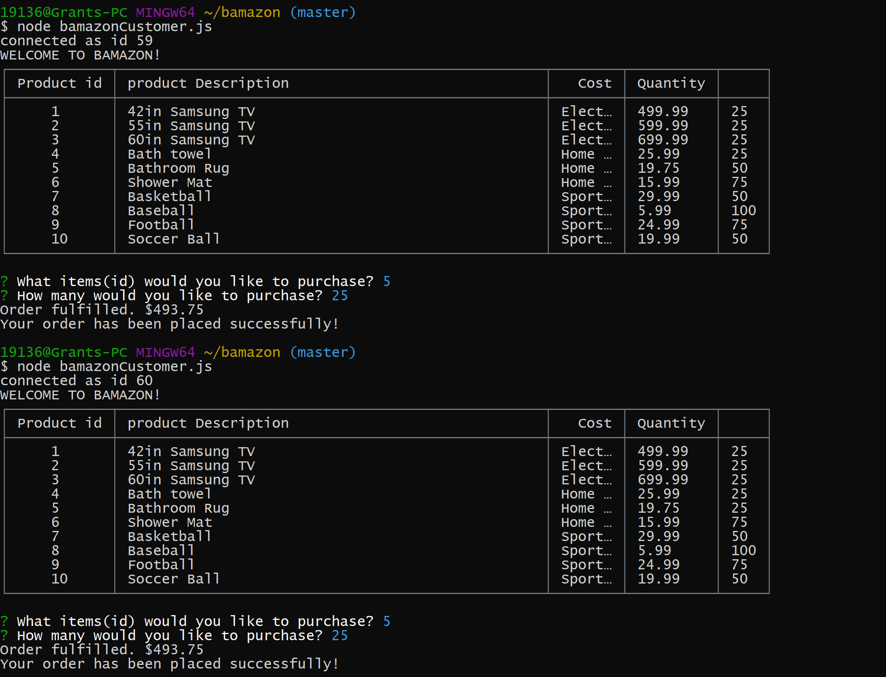

# bamazon

Using MySQL workbench I created a the bamazon_db with a table of contents in our "store"
I had multiple products ids (SKUs) that the customer could choose from. These IDs also had different department IDs.

Node.JS was used to create a backend for the user to purchase products from the store. 
The user would enter what ID they would like to purchase and the quantity. 
They would be told if the product was in stock and how much the order cost. 
OR they would be told "sorry we do not have enough stock."

